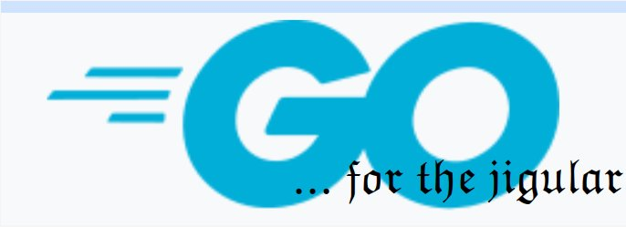

# XgO

The aim of the project is to add multi-platform UI for [X&O game](https://github.com/ratamahata/xo)
based on [Fyne](http://fyne.io) toolkit, pretty much on it's [tic tac toe](https://github.com/fyne-io/examples/tree/develop/tictactoe) example

[SWIG](https://www.swig.org/Doc3.0/Go.html) tool is used to incorporate C/C++ code into GO Lang

